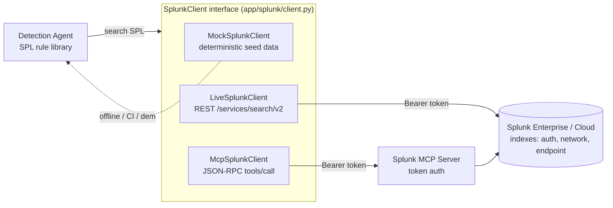
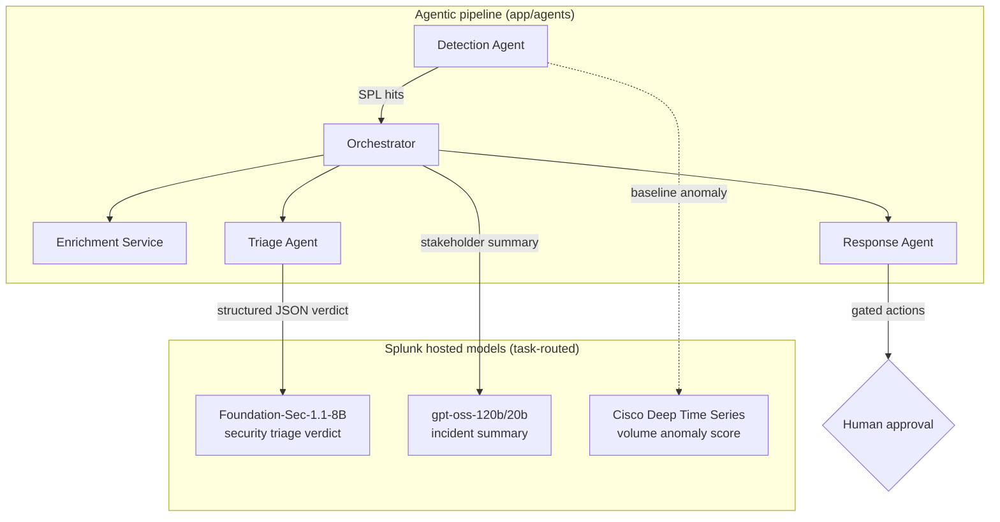
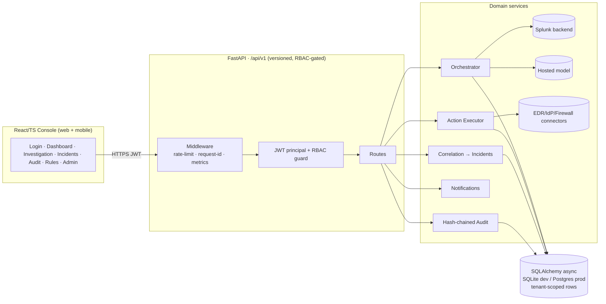

# SentinelAI — Architecture Diagram

> Submission-required diagram (Splunk Agentic Ops Hackathon · **Security** track).
> Shows (1) how the application interacts with Splunk, (2) how AI models/agents
> are integrated, and (3) data flow between services, APIs, and components.
> Renders on GitHub (Mermaid). A PNG export is at `docs/architecture_diagram.png`
> when generated; this Markdown file is the source of truth.

SentinelAI is an **agentic Threat Detection & Incident Response** platform that
runs an autonomous SOC loop on Splunk security data: it detects with SPL,
enriches, triages with a Splunk-hosted security LLM, plans containment actions
behind a human approval gate, executes via connectors, and writes every step to
a tamper-evident audit log — all multi-tenant and RBAC-scoped.

---

## 1. How the application interacts with Splunk

SentinelAI talks to Splunk through a single transport-agnostic `SplunkClient`
interface with **three interchangeable backends**, selected by one env var
(`SENTINEL_SPLUNK_BACKEND`). The agents never know which is active.

- **mock** — deterministic synthetic telemetry; powers tests + offline demo, no Splunk needed.
- **live** — Splunk REST search export API, token auth (OAuth is in Controlled Availability per hackathon guidance).
- **mcp** — **Splunk MCP Server** over MCP/JSON-RPC `tools/call`; the agent calls Splunk *as a tool* through one audited channel (targets "Best Use of Splunk MCP Server").

Resilience: every SPL call is wrapped in retry-with-backoff + a circuit breaker;
deterministic query errors are not retried.

---

## 2. How AI models / agents are integrated

Five cooperating agents form the loop. The AI sits behind an `AIModel`
interface; each task is routed to the **fit-for-purpose Splunk-hosted model**.

- **Boundary is enforced:** the model returns a *verdict* (TP/FP, confidence,
  rationale); the final **severity/risk number comes from the deterministic
  engine**, not the LLM. Malformed model output falls back to analyst review.
- **Model-agnostic:** swapping a model is config (`SENTINEL_AI_MODEL`,
  `SENTINEL_AI_BACKEND`), never code. Catalog is inspectable at `GET /ai/models`.

---

## 3. Data flow between services, APIs, and components

**Golden thread (end-to-end, runs in CI on mock):** analyst triggers
`POST /investigations/run` → Detection Agent runs SPL rules against Splunk →
events become Detections with extracted entities → Enrichment adds TI/asset/
identity context → Triage Agent calls Foundation-Sec for a verdict →
deterministic risk score assigned → Response Agent plans containment actions
(approval-gated) → investigations correlated into Incidents → high-risk
Incidents fire notifications → every step appended to the tamper-evident audit
log → analyst approves an action → Executor runs the connector → result audited.

## Tech stack

Backend: Python 3.11+, FastAPI, async SQLAlchemy 2.0, Alembic, structlog,
httpx, python-jose, bcrypt. Frontend: React 18, TypeScript, Vite, React Router.
Tests: pytest (150+ tests), Vitest, Playwright. Deploy: Docker + Compose + nginx.
