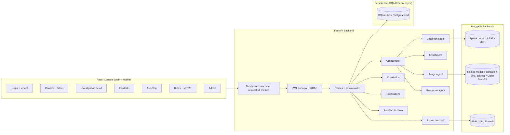
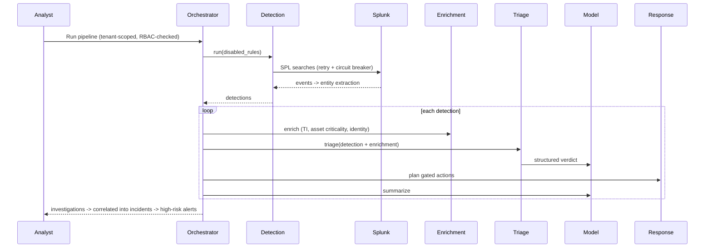

# Architecture

SentinelAI is a multi-tenant, agentic SOC platform: a Python/FastAPI backend
hosting the detection→enrichment→triage→response pipeline plus enterprise
services (persistence, audit, RBAC, case management, notifications), and a
React/TypeScript console, communicating over a versioned REST API.

## System overview

## Agentic pipeline

## Backend modules

- **splunk/** — `SplunkClient` ABC; three impls via factory: mock (offline),
  live (REST search export), and **mcp** (Splunk MCP Server, JSON-RPC tools/call).
- **services/ai_model.py** — `AIModel` ABC; mock + live hosted-model impls.
- **services/hosted_models.py** — Splunk hosted-model catalog + task routing
  (Foundation-Sec → triage, gpt-oss → summary, Cisco DeepTS → time-series).
- **services/enrichment.py** — threat intel, asset criticality, identity context.
- **agents/** — detection (MITRE rule library + entity extraction), triage,
  response (gated actions), orchestrator.
- **services/correlation.py** — groups investigations into incidents.
- **services/executor.py** — action execution via pluggable connectors.
- **services/workflow.py** — status transitions + SLA timers.
- **services/notifications.py** — pluggable alert channels.
- **services/audit.py** — append-only hash-chained audit log.
- **db/** — async SQLAlchemy engine, tenant-scoped ORM, repositories, bootstrap.
- **core/** — config, security (JWT+bcrypt), principal, RBAC, middleware,
  metrics, resilience.
- **api/** — routes, admin routes, schemas, dependencies (DI + RBAC guard).

## Multi-tenancy & security

Every business row carries `tenant_id`; repositories filter by it so isolation
is enforced at the data layer. JWTs carry the principal (user id, tenant, role).
A `require(permission)` dependency gates each route against the RBAC matrix.
Every privileged action is written to a per-tenant hash-chained audit log whose
integrity is verifiable (`verify_chain`).

## Data model

`SplunkEvent → Detection (+enrichment, entities) → TriageVerdict → IncidentAction
→ Investigation → Incident`. Persisted as queryable headers plus JSON aggregates;
case notes and audit entries are separate tenant-scoped tables.

## Design decisions

1. Transport-agnostic Splunk/model/connector clients — run fully offline (mock)
   or against live infrastructure by configuration only.
2. Human-in-the-loop: state-changing actions are planned, approved, then executed.
3. Detections, rules, and enrichment providers are data/pluggable, not hardcoded.
4. Tenant isolation and audit are structural, not bolted on.
